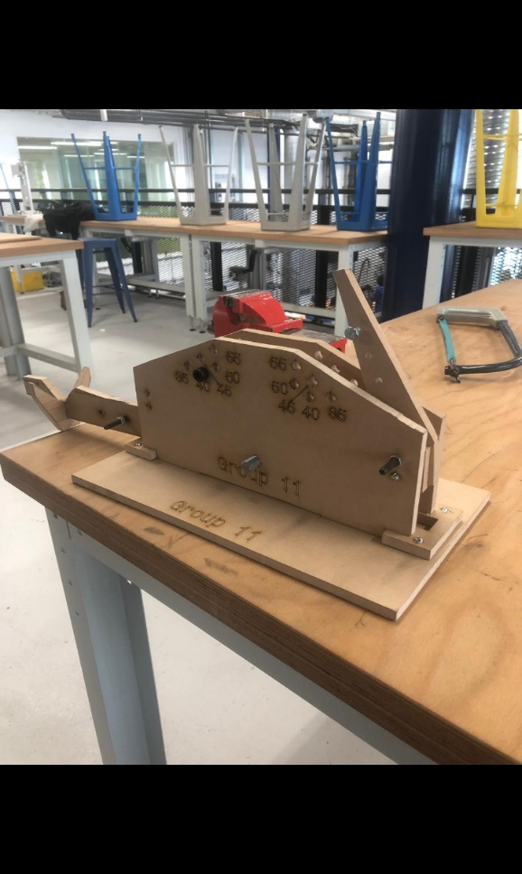
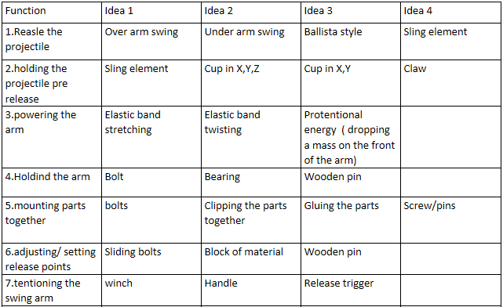
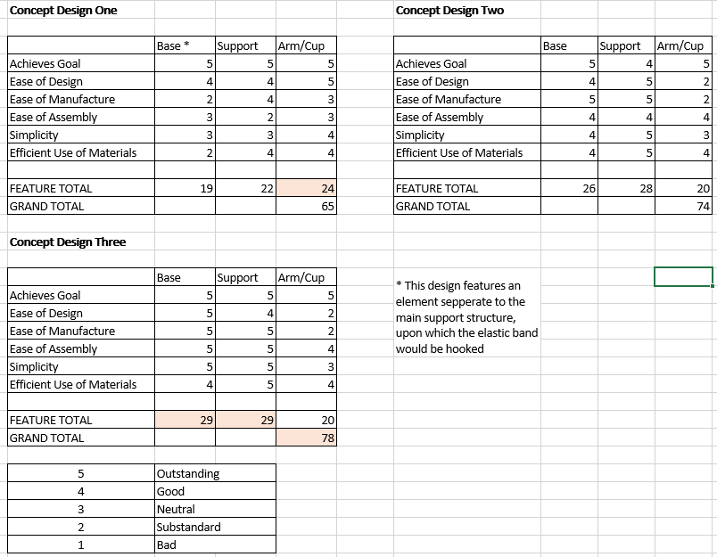
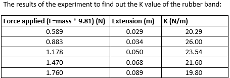
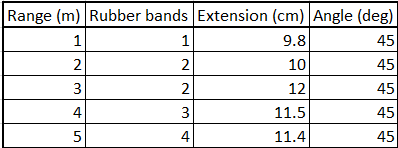
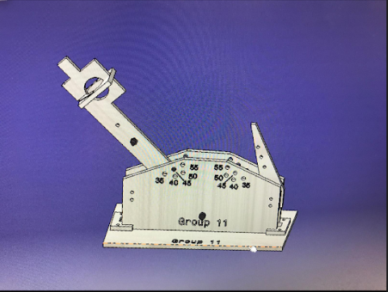
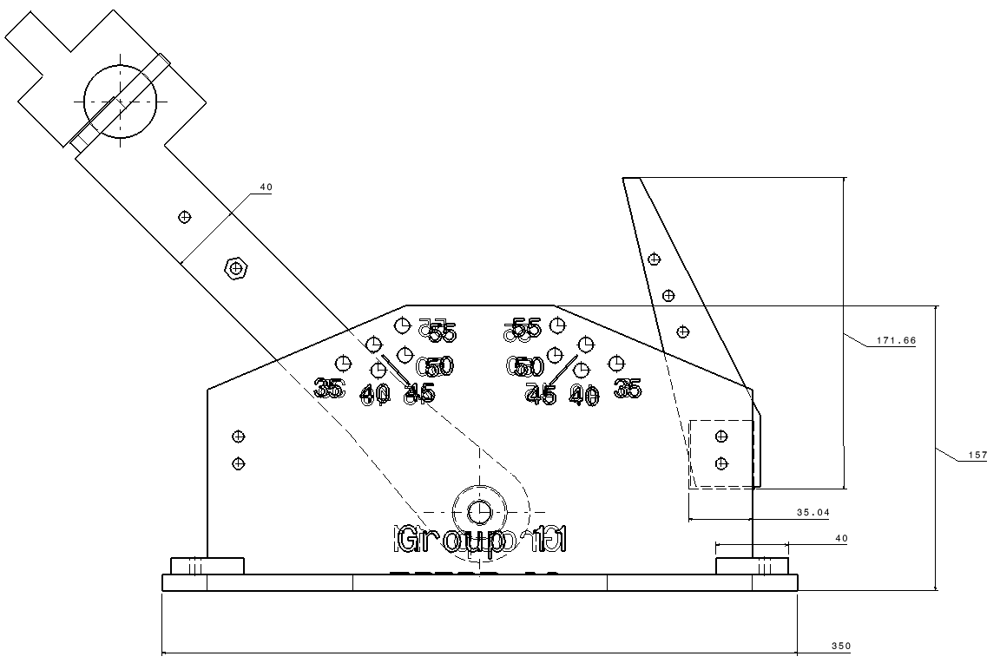
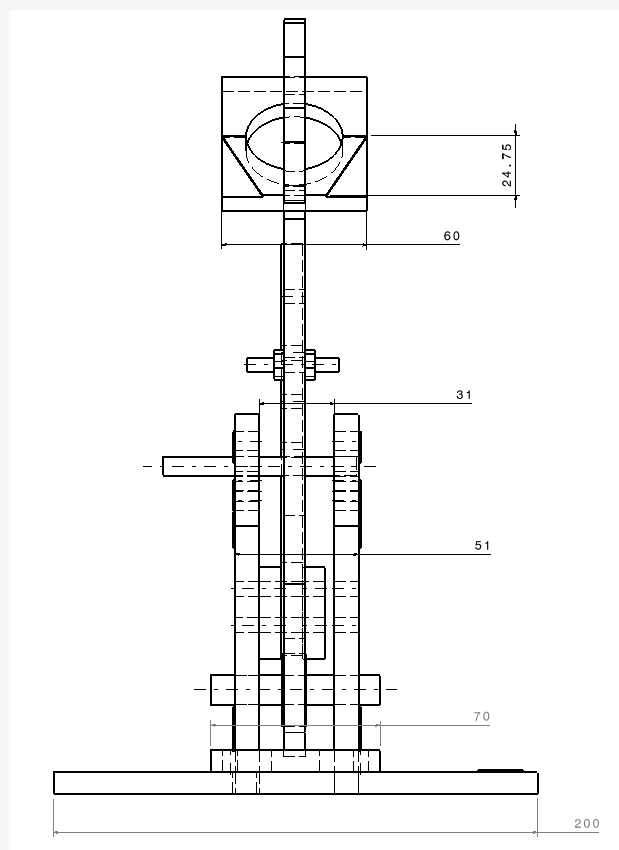

# Squash-Ball-Catapult-Engineering
Design and mathematical analysis of an adjustable MDF catapult for variable range targeting.

# Squash Ball Catapult Engineering Project - Group 11

This repository documents the design, mathematical analysis, and manufacture of an adjustable catapult built by Group 11 at Birmingham City University.

## 🎯 Project Overview
The objective was to design and build a catapult to launch squash balls at targets between 1–5 metres. 

### 📐 Constraints
* **Materials**: A single 600 x 600 x 9 mm piece of MDF.
* **Fasteners**: Maximum of 30 individual semi-permanent fasteners (nuts, bolts, and washers).
* **Adjustability**: The design must be "settable" for variable distances.

*The final physical prototype, hand-cut from 9mm MDF.*

---

## 🛠 Engineering Methodology

### 1. Research & Concept Selection
We researched three traditional catapult styles: the Ballista, Trebuchet, and Mangonel.

* **Morphological Analysis**: We compared different sub-functions, such as power sources (elastic stretching vs. twisting) and projectile holders (slings vs. cups).

*Morphological analysis used to address feasability concerns.*

* **Pugh Matrix**: We evaluated three concepts against criteria like ease of manufacture and simplicity. Concept 3 was selected with a grand total of 78 points.

*Decision-making matrix used to objectively select the final design.*

### 2. Mathematical Analysis
We conducted a series of experiments to find the spring constant ($k$) of the rubber bands using Hooke's Law:
$$F = -kx$$

**Ballistic Range Calibration**:
Using ballistic motion equations and adjusting for drag, we developed a precise setting guide for the catapult:

*Settings required to hit targets between 1m and 5m.*

---

## 💻 Technical Design

### CAD Modeling (CATIA)
The catapult was modeled using CATIA, creating an assembly of five distinct parts: the base, two sides, a post, and the swing arm.

*Full assembly render showcasing the adjustable release points.*

### Technical Drawings
* **Base Dimensions**: 350mm length.
* **Swing Arm**: 300mm length with a 40mm pivot width.

| Side View | Front View |
| :--- | :--- |
|  |  |

---

## 📈 Manufacturing & Reflection

### Pivot to Hand-Cutting
Due to the laser cutter being unavailable, we generated a DXF template and cut the pieces out by hand. While this introduced potential human error in accuracy, it proved our design remained within material constraints.

### Problem Solving & Results
* **Lateral Motion**: We identified that the arm would throw off-center due to lateral movement. We overcame this by replacing nuts with MDF spacers to stabilize the arm.
* **Consistency**: By repeating tests 3 times per distance to find a mean average, we achieved consistent target hits.

Full project available at [Catapult-project.pptx](Catapult-project.pptx)
